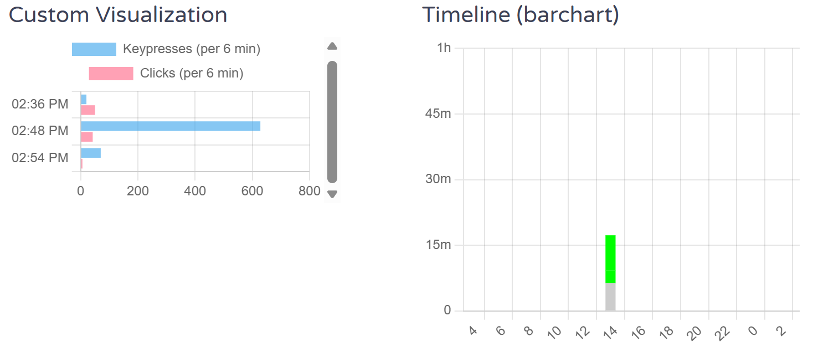
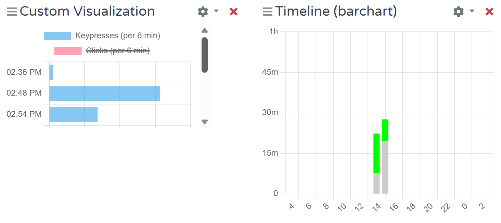

A Custom Visualization that visualizes Keypresses and Clicks
======

# Introduction

This project is based on [aw-watcher-input](https://github.com/ActivityWatch/aw-watcher-input) and (supposedly) allows you to visualize your keypresses and clicks, although in an extremely imperfect way.

The project [aw-watcher-input](https://github.com/ActivityWatch/aw-watcher-input) already provides a demonstrative code that shows how to visualize one's total keypresses and clicks throughout the day. This project **intends to plot it into a bar chart that visualizes their temporal change, instead of their aggregate number.**

Its effect should look like this:



# How to Make it Work
## One-sentence Summary
For those who are apt at coding, here's a one-sentence summary: copy the `visualization` folder I uploaded to `.\ActivityWatch\aw-watcher-input`, then follow the instructions from [aw-watcher-utilization](https://github.com/Alwinator/aw-watcher-utilization) to set the custom visualization. But make sure you've already installed *aw-watcher-input* otherwise the visualization will not work.

## Prerequisites
However, I really have no idea about builds and all that stuff. I am just an ordinary guy who's looking for a tool that records what I do throughout the day, especially how many keypresses I make. Therefore I will teach you how to make this visualization work in the most unprofessional and stupid way.

I will assume that you downloaded *ActivityWatch* with the official installer, which is how people normally download every software. If you didn't, I'll assume that you are smart enough to check whether the watcher *aw-watcher-input* has been downloaded properly, and will be able to follow the instructions from [aw-watcher-input](https://github.com/ActivityWatch/aw-watcher-input) in case it hasn't been properly downloaded. I will also assume that you use Windows. If you use Mac or some other system, let's just hope what I describe below still works.

## Step 1
Go to the folder where *ActivityWatch* is installed (where the application `aw-qt.exe` is located). By default it would be `C:\Program Files (x86)\ActivityWatch` or somewhere similar, though for me it is `D:\Softwares\ActivityWatch` because I used custom installation.

Inside the `something\...\something\ActivityWatch` folder, you should find a folder called `aw-watcher-input`. I think this now comes with the official installer by default, so building it manually is no longer a must (I mention this because [aw-watcher-input](https://github.com/ActivityWatch/aw-watcher-input) seems to teach you how to build it manually, but that's likely unnecessary for most ordinary users.).

Now download the `visualization` folder I uploaded. Paste it directly into the `aw-watcher-input` folder on your computer. Stuff in this folder were built using Powershell and I encountered a lot of problems during this process, so I thought that uploading the entire folder directly might be a good (though less professional) idea.

## Step 2
Go to the [config directory](https://docs.activitywatch.net/en/latest/directories.html#config). For me the config directory is `%LocalAppData%\activitywatch\activitywatch`. 

Then go to the `aw-server` folder. Inside it you will find a file called `aw-server.toml`. Open this file with VSCode or Notepad, and you'll probably see something like this in the middle:

```
#cors_origins = ''

[server.custom_static]

[server-testing]
```

Append one line to this file, as shown below:

```
#cors_origins = ''

[server.custom_static]
aw-watcher-input = 'something/.../something/ActivityWatch/aw-watcher-input/visualization/dist'

[server-testing]
```

The `visualization` in the appended line refers to the `visualization` folder you just pasted. Find where it is and change the `something/.../something` part to the correct directory. For example I'll write `aw-watcher-input = 'D:/Softwares/ActivityWatch/aw-watcher-input/visualization/dist'`.

## Step 3
Quit *ActivityWatch*. You should be able to find *ActivityWatch* in your system tray. Right-click on the icon and select 'Quit ActivityWatch'.

Then restart *ActivityWatch*. Find it in your apps and click on it. You'll know it's started if you see the icon re-appear in your system tray.

## Step 4
Again right-click on the icon. Hover over 'Modules' and make sure *aw-watcher-input* is checked (enabled). *aw-watcher-input* is the thing that collects your keypress and mouse movement data, so the visualization won't work without it.

## Step 5
Go to the dashboard. Again you can see 'Open Dashboard' if you right click on the icon. Then go to the 'Activity' pane.

Click 'Edit view', then 'Add visualization', then click the cogwheel and select 'Custom visualization'. This will open a popup asking for which visualization, here enter the word 'input' to make the watcher name 'aw-watcher-input' (I copied this bit directly from [aw-watcher-input](https://github.com/ActivityWatch/aw-watcher-input)). It will also tell you to 'enter the visualization title', which you can just enter anything you want, it won't make much difference. 

# Functions and Flaws
First, flaws. 

The biggest flaw is that I don't know how to code js and html at all, so my codes were written by Gemini. Therefore I don't think I can provide any help if anything goes wrong, my apologies. 

`bundle.js` and `index.html` are the two files this custom visualization depends on. `bundle.js` was directly modified from the original version provided by [aw-watcher-input](https://github.com/ActivityWatch/aw-watcher-input) (up to Aug 23, 2025), and one line of code was added to overpass the aggregation and provide timestamped data. `index.html` was completely written by Gemini, although it may have referenced the respective file from [aw-watcher-utilization](https://github.com/Alwinator/aw-watcher-utilization). You are free to replace them with the original files, stored in `./visualization/dist/original`.

I am grateful to developers of these two custom visualizations, as well as the developers of *ActivityWatch*.

The second flaw is about the visualization itself. It provides a truncated view and I don't really know how to fix it. I think the same problem also exists in three other officially documented custom visualizations. Gemini says that this problem can't possibly be resolved unless *ActivityWatcher* changes the source code of its web UI, because the UI now places the custom visualization in an `<iframe>` container with a fixed size (which is a lot smaller than all other visualizations).

To overcome this problem, my (in fact Gemini's) visualization provides a scrollbar that you can scroll to check more data. You can also click on the legend to enable/disable the display of either keypresses or clicks, depending on which you care about more:



I hope this documentation gives you the information you need.

# Licensing

This repository’s visualization code `index.html` is AI-generated and licensed under MIT (see `LICENSE.txt`). `bundle.js` is a modified from the respective file provided by [aw-watcher-input](https://github.com/ActivityWatch/aw-watcher-input), which is licensed under the Mozilla Public License 2.0 (see `LICENSE-MPL.txt`).
